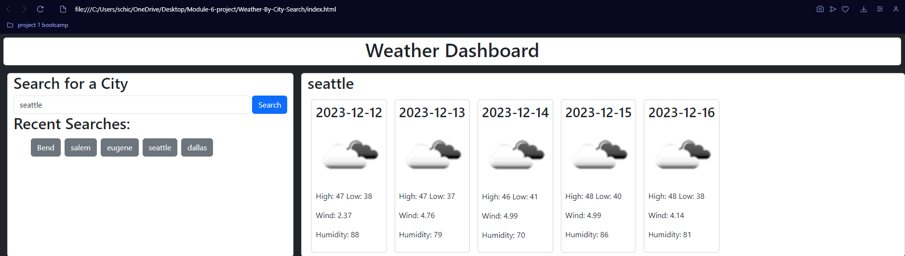

# Weather-By-City (Module 6 Challenge)

## Description

This Module 6 Challenge was given to me to complete. The goal was to build a site where the user can search for a desired city and then be presented with the forecast for the next five days.

## Installation

N/A

## Usage

This page is to act as a Forecast search tool. The user types in the desired city and the weather API will pull data from that city and display the weather forecast for the next five days 
## Credits

I worked on this project with Chase Seeberger. https://github.com/ChaseLee21/weather-search

## Link

https://github.com/willber10/Weather-By-City-Search

## Screenshot

## License

Please refer to the LICENSE in the repository.
